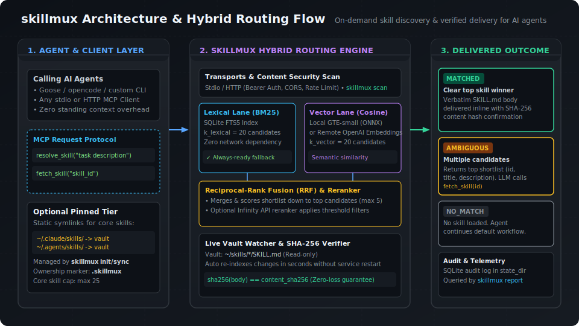

<p align="center">
  
</p>

A local, read-only [MCP](https://modelcontextprotocol.io) stdio server that gives agents **on-demand skill discovery**: route a natural-language task description to the right skill in your vault and deliver its `SKILL.md` byte-for-byte, verified by SHA-256.

Built for agents that lack native skill triggering (Goose recipe workers, opencode, and friends). Agents that already trigger skills natively (e.g. Claude Code) don't need it.

- [How it works](#how-it-works)
- [Tiers: routed vs. pinned](#tiers-routed-vs-pinned)
- [Install](#install)
- [Quick start](#quick-start) — the fastest path to seeing it respond
- [Pinning skills across surfaces](#pinning-skills-across-surfaces) — optional: statically load a curated set across multiple agents
- [Docker Usage](#docker-usage)
- [Configuration](#configuration) — inference modes, security scanning, installing skills, env vars
- [CLI & Automation](docs/cli.md) — context management, remote target resolution, policy calibration, JSON envelopes
- [Benchmarks & Evaluation](#benchmarks--evaluation)
- [FAQ & Troubleshooting](#faq--troubleshooting)
- [Guarantees](#guarantees)
- [Development](#development)

## How it works

<p align="center">
  
</p>

```
resolve_skill("convert this spreadsheet to markdown")
        │
        ▼
  hybrid recall: SQLite FTS5 (BM25)  ∪  embedding cosine (brute-force)
        │
        ▼
  reciprocal-rank fusion → shortlist
  optional reranker      → matched | ambiguous | no_match
```

- **matched** — one skill clearly wins: full `SKILL.md` delivered inline, `sha256(body) == content_sha256 ==` hash of the file on disk at delivery time. Stale index? It re-indexes and delivers fresh bytes — never stale ones.
- **ambiguous** — up to 10 candidates (id, title, description). The calling LLM picks and calls `fetch_skill`.
- **no_match** — proceed under your normal workflow; don't load an unrelated skill.

If embeddings are unavailable, the router remains ready with FTS5 lexical retrieval. If an optional reranker is unavailable, it preserves the hybrid shortlist instead of failing.

### Tools

| Tool | Input | Returns |
|------|-------|---------|
| `resolve_skill` | `query` | outcome + metadata in `structuredContent`; on match the verbatim body as text content (exactly once on the wire) |
| `fetch_skill` | `skill_id` | verbatim body, `content_sha256`, supporting-file paths |

The full contract lives in [`docs/schema.json`](docs/schema.json) (JSON Schema 2020-12, language-neutral).

## Tiers: routed vs. pinned

Skills live in one vault, but there are two ways an agent gets one:

- **routed** — the default, described above. Nothing is loaded up front; the agent calls `resolve_skill` on demand and gets back exactly the skill that matches. This scales to hundreds of skills at zero standing cost.
- **pinned** (`core` / `project`) — a small, hand-picked set of skills symlinked directly into an agent's own skill directory (e.g. `~/.claude/skills`), so they load the same way any other skill on that agent does — no MCP round-trip, no query. `core` pins apply everywhere; `project` pins apply only inside one repo.

Pinning is optional and orthogonal to serving: `skillmux init`/`sync` manage what's pinned; `skillmux serve` is what answers `resolve_skill` for everything else. Most single-agent setups never need pinning — reach for it once you're running the same small set of skills across multiple agent surfaces (Claude Code, opencode, ...) and don't want to maintain that list by hand in each one. See [Pinning skills across surfaces](#pinning-skills-across-surfaces).

## Install

### Linux Binary

Download the latest release for your architecture:

```sh
# AMD64
gh release download --repo klhq/skillmux \
  --pattern 'skillmux-linux-*'

# Optional: verify build provenance
gh attestation verify skillmux-linux-amd64 --repo klhq/skillmux

# Install the binary matching your machine (amd64 or arm64)
chmod +x skillmux-linux-amd64
sudo install skillmux-linux-amd64 /usr/local/bin/skillmux
skillmux config show
```

Release assets are also available at <https://github.com/klhq/skillmux/releases/latest>.

Requirements at runtime:

- A skill vault: one directory per skill with a `SKILL.md` in [agentskills.io](https://agentskills.io) format. Default: `~/skills`.
- Optional remote OpenAI-compatible embeddings and Infinity-native reranking. The full binary uses local GTE-small embeddings by default.

## Quick start

No config is required — the vault defaults to `~/skills`, and the full binary embeds its own local model, so there's nothing to download or provision first.

### 1. Put a skill in your vault

A skill is just a directory with a `SKILL.md`. Author one by hand to try against:

```sh
mkdir -p ~/skills/csv-formatter
cat > ~/skills/csv-formatter/SKILL.md <<'EOF'
---
name: CSV Formatter
description: Converts CSV or spreadsheet data into clean, aligned Markdown tables. Use whenever the user asks to convert, format, or clean up tabular/CSV/spreadsheet data into Markdown.
---

# CSV Formatter

Given raw CSV input, emit a well-aligned Markdown table: infer column headers
from the first row, right-align numeric columns, left-align text columns.
EOF
```

(Or fetch an existing skill from a git repo instead — see [Installing skills](#installing-skills) below.)

### 2. Index and verify

```sh
skillmux index
skillmux doctor
```

`doctor` should report `routing capability: hybrid` and every check `ok`. If something's `fail`, the `detail` column names the exact path or setting to fix.

### 3. Serve it

```sh
skillmux serve
```

Register with your MCP client directly, e.g.:

```json
{
  "mcpServers": {
    "skillmux": {
      "command": "skillmux",
      "args": ["serve"]
    }
  }
}
```

### Try it without an MCP client

To see `resolve_skill` respond without wiring up a client, run the HTTP transport instead (`skillmux serve --transport http`, default port `3000`) and speak MCP's Streamable HTTP protocol directly:

```sh
# 1. Initialize a session, capture the session id from the response header
SESSION=$(curl -sS -D - -o /dev/null http://127.0.0.1:3000/mcp \
  -H "Content-Type: application/json" -H "Accept: application/json, text/event-stream" \
  -d '{"jsonrpc":"2.0","id":1,"method":"initialize","params":{"protocolVersion":"2025-06-18","capabilities":{},"clientInfo":{"name":"try-it","version":"1.0.0"}}}' \
  | grep -i '^mcp-session-id:' | tr -d '\r' | cut -d' ' -f2)

# 2. Complete the handshake
curl -sS -o /dev/null -X POST http://127.0.0.1:3000/mcp \
  -H "Content-Type: application/json" -H "Accept: application/json, text/event-stream" \
  -H "mcp-session-id: $SESSION" \
  -d '{"jsonrpc":"2.0","method":"notifications/initialized"}'

# 3. Call resolve_skill
curl -sS -X POST http://127.0.0.1:3000/mcp \
  -H "Content-Type: application/json" -H "Accept: application/json, text/event-stream" \
  -H "mcp-session-id: $SESSION" \
  -d '{"jsonrpc":"2.0","id":2,"method":"tools/call","params":{"name":"resolve_skill","arguments":{"query":"convert this spreadsheet to markdown"}}}'
```

Against the `csv-formatter` skill authored above, that returns a real match — trimmed here for length:

```json
{"result":{"structuredContent":{"outcome":"ambiguous","retrieval":"hybrid","candidates":[
  {"skill_id":"csv-formatter","title":"CSV Formatter","description":"Converts CSV or spreadsheet data..."}
]}}}
```

`outcome` is `"ambiguous"` here specifically because the vault only has one skill in it — with more skills installed, a clear top match returns `"matched"` with the full `SKILL.md` body inline instead of a candidate list.

### Run from source instead

```sh
bun install --frozen-lockfile
bun run src/cli.ts index
bun run src/cli.ts serve
```

## Pinning skills across surfaces

Optional — skip this if `resolve_skill` alone is enough (most setups). Use it once you want a small set of skills loaded *statically* in every agent that reads from a given directory, instead of routed on demand — see [Tiers](#tiers-routed-vs-pinned).

### 1. Discover surfaces and adopt one

```sh
skillmux init
```

Lists candidate surfaces (default: `~/.claude/skills`, `~/.agents/skills`) with their dir/symlink status and skill count. Nothing is written until you pass `--target`:

```sh
skillmux init --target claude --yes
```

This writes `skillmux.toml` at the vault root and marks `~/.claude/skills` as skillmux-owned — a `.skillmux` marker file that `sync` requires before it will touch the directory.

### 2. Pick which skills are pinned

`init` always starts `[core]` empty — there's no heuristic yet for which skills belong there. Edit `skillmux.toml` by hand:

```toml
[core]
skills = ["csv-formatter"]

[targets.claude]
dir = "/Users/you/.claude/skills"
project_groups = []
```

Cap: 25 skills in `[core]`. Full manifest schema, including `[project.<group>]` pins scoped to one repo and machine-local overlay vaults via `local_vault_paths`, is in [`docs/configuration.md`](docs/configuration.md#tiers-and-the-manifest).

### 3. Materialize

```sh
skillmux sync
# claude: +1 -0
```

Each pinned skill becomes a symlink from the target dir into the vault. Re-running `sync` is idempotent (`+0 -0` once nothing changed); removing a skill from `[core]` removes its symlink on the next sync.

```sh
skillmux sync --dry-run           # preview +added/-removed without touching disk
skillmux sync --install-hook      # add a git post-merge hook in the vault that runs `skillmux sync` automatically
skillmux sync --restore-monolith  # undo: replace a target dir with one symlink straight to the vault
```

`--restore-monolith` drops the `.skillmux` marker along with the per-skill symlinks — re-adopt with `skillmux init --target <name> --yes` before that target can be `sync`'d again.

### 4. See what's actually getting used

`skillmux report` reads the same audit log `resolve_skill` writes to (see [Guarantees](#guarantees)) — useful for deciding what belongs in `[core]` versus staying routed:

```sh
skillmux report --since 7d                              # local: reads state_dir's audit db
skillmux report --server http://host:3000 --since 7d    # remote: hits a running server's /stats
```

```
window: 2026-07-14T00:00:00Z .. 2026-07-21T00:00:00Z
outcomes: matched=0 ambiguous=2 no_match=0 (ambiguous_rate=1.000)
skills:
  csv-formatter matched=0 candidate=2
  pdf-extractor matched=0 candidate=2
top no_match queries:
  (none)
```

`--since` accepts a relative window (`1h`, `7d`, `1m`) or an absolute date/timestamp. A skill matched often but never pinned is a `[core]` candidate; a query that keeps showing up in `top_no_match_queries` means the vault is missing something.

## Docker Usage

The `skillmux` is packaged and distributed as a Docker image in two variants:

1. **`skillmux:latest`**: Bundles the small quantized GTE embedding model for local hybrid retrieval.
2. **`skillmux:latest-slim`**: Excludes model weights and supports configured remote embeddings or lexical fallback.

Both tags are multi-architecture manifests for Linux AMD64 and ARM64; Docker selects the correct image automatically. Images are published to both [`ghcr.io/klhq/skillmux`](https://github.com/klhq/skillmux/pkgs/container/skillmux) and [`docker.io/lazyskyline/skillmux`](https://hub.docker.com/r/lazyskyline/skillmux) — either registry works, examples below use GHCR.

### Running HTTP Server (Docker Default)

To run as an HTTP MCP service (default in Docker):

```sh
# Battery-included (runs local in-process ONNX models)
docker run -d \
  --name skillmux \
  -v ~/skills:/vault:ro \
  -v skillmux-data:/data \
  -p 3000:3000 \
  ghcr.io/klhq/skillmux:latest

# Slim (configured remote embeddings, or lexical fallback)
docker run -d \
  --name skillmux-slim \
  -v ~/skills:/vault:ro \
  -v skillmux-data:/data \
  -p 3000:3000 \
  -e EMBED_BASE_URL="http://embeddings-host:8080" \
  ghcr.io/klhq/skillmux:latest-slim
```

Connect your MCP client to the HTTP endpoint (e.g. standard Streamable HTTP transport):
- POST messages to `http://localhost:3000/mcp`

#### HTTP server: auth, CORS, rate limiting

All of the below is `[server]` config in `config.toml`, overridable by environment variable — see [Environment Variable Overrides](#environment-variable-overrides).

- **Bind address** (`hostname`, default `127.0.0.1`) — HTTP transport binds loopback-only by default, so a zero-config `skillmux serve --transport http` isn't reachable from the network. Inside Docker (`RUNNING_IN_DOCKER=true`) this defaults to `0.0.0.0` instead, since the container's own loopback isn't reachable through port-mapping. Set `hostname` (or `HTTP_HOSTNAME`) explicitly to expose the server beyond localhost.
- **Bearer token auth** (off by default) — set `auth_enabled = true` and the token via the env var named by `auth_token_env` (default `SKILLMUX_AUTH_TOKEN`). Requests need `Authorization: Bearer <token>`; missing/mismatched tokens get `401`, and a configured-but-empty token env var gets `500`.
- **CORS** — `allowed_origins` (default `[]`, deny-by-default) is checked against the request's `Origin` header; disallowed origins get `403`. Requests with no `Origin` header (curl, MCP clients, server-to-server) are unaffected either way — only browser-issued cross-origin requests are gated. `/health` and `/metrics` are excluded from auth but still CORS-checked.
- **Rate limiting** (off by default) — per-token (when auth is enabled) or per-IP (`server.requestIP`) token-bucket limiting. Enable with `rate_limit.enabled = true` and set `rate_limit.requests_per_minute` (default `60`). The `X-Forwarded-For` header is ignored unless `rate_limit.trust_proxy = true` — it's client-supplied and spoofable, so only opt in when a trusted reverse proxy sets it. Every response carries `X-RateLimit-Limit`/`X-RateLimit-Remaining`/`X-RateLimit-Reset`; over-limit requests get `429` plus `Retry-After`.
- **`GET /health/live`** — lightweight liveness check. Legacy `GET /health` remains an alias.
- **`GET /health/ready`** — readiness with active retrieval capability, skill count, index state, and inference status.
- **`GET /metrics`** — Prometheus text exposition: `skill_router_requests_total`, `skill_router_resolve_outcomes_total`, `skill_router_resolve_latency_seconds` (histogram), `skill_router_errors_total`, `skill_router_rate_limits_exceeded_total`.

### Running Stdio Server in Docker

If your agent runs locally and expects a piped stdio process:

```sh
docker run -i --rm \
  -v ~/skills:/vault:ro \
  ghcr.io/klhq/skillmux:latest serve --transport stdio
```

## Configuration

No config is required for the battery-included local ONNX mode. See [`config.example.toml`](config.example.toml) for the minimal local setup, [`config.remote.example.toml`](config.remote.example.toml) for bring-your-own endpoints, and [`docs/configuration.md`](docs/configuration.md) for advanced settings.

### Inference Modes

- The zero-config default combines SQLite FTS5 with the small `Xenova/gte-small` embedding model and returns an ordered shortlist.
- Configured OpenAI-compatible embeddings replace the local embedder. An optional Infinity-compatible reranker enables confident automatic matches.

Run `skillmux doctor` to verify routing capability. Run `skillmux config show` to inspect effective configuration; it prints credential variable names, never values.

### Security scanning

`skillmux scan [<path>]` inspects skill content for prompt-injection and data-exfiltration risk indicators
before it's served over MCP or HTTP. It's offline (no network call, no inference config needed),
read-only, and advisory-only — it never blocks `skillmux index`/`sync`/`init`, which don't call it
automatically.

```sh
skillmux scan                          # scan the configured vault_path
skillmux scan ~/skills/some-skill      # scan a single candidate skill dir before adding it
skillmux scan --format json            # machine-readable { scanned, findings } for CI
skillmux scan --fail-on high           # exit 1 if any finding is high severity (for CI gating)
```

The v1 rule set covers four categories, each attached to the finding as `rule_id` with a fixed
`severity`:

| `rule_id` | `severity` | Flags |
|---|---|---|
| `prompt-injection-phrase` | `high` | Known instruction-override phrases (e.g. "ignore previous instructions") |
| `invisible-unicode` | `high` | Zero-width/invisible Unicode code points, including hidden tag-character payloads |
| `secret-pattern` | `high` | Hardcoded-credential-shaped strings (AWS-style keys, PEM blocks, `api_key=`/`token=` assignments) |
| `suspicious-url` | `medium` | Bare-IP-address URLs, or URLs paired with exfiltration-suggesting text |

`skillmux scan` is unrelated to the `audit` SQLite table / `skillmux report` — that's query telemetry (what got
routed where); `skillmux scan` is content security (what's in the vault).

### Installing skills

`skillmux install <repo>[/path]` fetches one skill from a git repo (GitHub shorthand, full HTTPS/SSH URL,
or `file://`) into the configured `vault_path`, so onboarding doesn't require a second CLI just to
pull a skill in. It's a convenience fetch, not a distribution system:

```sh
skillmux install owner/repo                             # repo root must itself be a skill
skillmux install owner/repo/path/to/skill                # select one skill out of a multi-skill repo
skillmux install owner/repo --dry-run                   # preview id, target path, and scan findings
skillmux install owner/repo --force                     # overwrite an existing skill_id
skillmux install owner/repo --fail-on high               # abort the install if scan findings meet the threshold
```

The fetched skill is validated the same way `skillmux scan` validates the vault — malformed `SKILL.md`
aborts the install, and scan findings are printed before anything is written (advisory by default;
`--fail-on` opts into blocking, matching `skillmux scan`'s severity levels). Materialization is a plain
file copy, not a symlink — the temporary clone is deleted once the install completes.

`skillmux install` intentionally does **not** handle updates, uninstalls, version pinning, or
core/project/routed tier assignment (that's `skillmux sync`'s domain) — it only ever fetches one skill,
once. Use `skillmux sync` afterward if the installed skill needs to be pinned into a tier.

### Environment Variable Overrides
All core settings can be overridden via environment variables (handy for Docker):
- `VAULT_PATH` — overrides `vault_path` (defaults to `/vault` inside Docker)
- `STATE_DIR` — overrides `state_dir` (defaults to `/data` inside Docker)
- `EMBED_BASE_URL` / `SKILLMUX_EMBED_BASE_URL` — overrides remote `inference.embedding.base_url`
- `EMBED_MODEL` / `SKILLMUX_EMBED_MODEL` — overrides `embedding.model`
- `EMBED_DIMENSION` / `SKILLMUX_EMBED_DIMENSION` — overrides `embedding.dimension`
- `EMBED_DEVICE` / `EMBED_DTYPE` — overrides local `inference.embedding.device` / `inference.embedding.dtype`
- `RERANK_BASE_URL` / `SKILLMUX_RERANK_BASE_URL` — overrides remote `inference.reranker.base_url`
- `RERANK_MODEL` / `SKILLMUX_RERANK_MODEL` — overrides `rerank.model`
- `SKILLMUX_CONFIG` — path to custom `config.toml` (default `~/.config/skillmux/config.toml`)
- `SKILLMUX_MODELS_DIR` — path to directory storing downloaded local models (default `~/.cache/skillmux/models`, `/models` inside Docker)
- `PORT` — HTTP listen port (default `3000`, HTTP transport only)
- `HTTP_HOSTNAME` — overrides `server.hostname` (default `127.0.0.1`, `0.0.0.0` inside Docker)
- `HTTP_AUTH_ENABLED` — overrides `server.auth_enabled` (`"true"` to enable)
- `HTTP_AUTH_TOKEN_ENV` — overrides `server.auth_token_env`
- `HTTP_ALLOWED_ORIGINS` — comma-separated list, overrides `server.allowed_origins`
- `HTTP_RATE_LIMIT_ENABLED` / `SKILLMUX_HTTP_RATE_LIMIT_ENABLED` — overrides `server.rate_limit.enabled` (`"true"` to enable)
- `HTTP_RATE_LIMIT_RPM` / `SKILLMUX_HTTP_RATE_LIMIT_RPM` — overrides `server.rate_limit.requests_per_minute`
- `HTTP_RATE_LIMIT_TRUST_PROXY` / `SKILLMUX_HTTP_RATE_LIMIT_TRUST_PROXY` — overrides `server.rate_limit.trust_proxy` (`"true"` to trust `X-Forwarded-For`)

Remote API keys are read from the environment variables named by `inference.embedding.api_key_env` and `inference.reranker.api_key_env`; no secret ever lives in the config file.

## Benchmarks & Evaluation

Skillmux includes a built-in evaluation framework to benchmark retrieval accuracy (lexical vs. hybrid vector search) against labeled intent datasets.

Evaluate lexical and local hybrid retrieval against the checked-in labeled queries:

```sh
bun run src/cli.ts eval
# holdout queries: 8
# lexical recall@5: 1.000
# hybrid recall@5:  1.000
```

Custom policy calibration can also be performed against domain-specific query logs using `skillmux calibrate` (see [`docs/cli.md`](docs/cli.md#policy-calibration-skillmux-calibrate)).

## FAQ & Troubleshooting

<details>
<summary><b>Why did my query return <code>ambiguous</code> instead of <code>matched</code>?</b></summary>

<br>

The router returns `"outcome": "ambiguous"` when multiple candidate skills meet retrieval confidence thresholds, or when no single candidate dominates by a sufficient score margin. In this state, up to 10 candidate skill summaries (`skill_id`, `title`, `description`) are returned so the calling LLM can choose the exact skill and invoke `fetch_skill`.

</details>

<details>
<summary><b>Does skillmux require an active internet connection?</b></summary>

<br>

No. In default local inference mode (`inference.mode = "local"`), skillmux operates 100% offline. The default GTE-small embedding model is quantized to q8 and bundled within the binary/Docker image.

</details>

<details>
<summary><b>What happens when remote embedding or reranking endpoints fail?</b></summary>

<br>

Skillmux features automatic fallback degradation. If remote embedding APIs or rerankers become unreachable, the router gracefully falls back to SQLite FTS5 lexical search rather than throwing an error to the calling agent.

</details>

<details>
<summary><b>When should I use routed skills vs. pinned skills?</b></summary>

<br>

- **Routed (Default)**: Best for expanding vaults with dozens or hundreds of skills. Skills are loaded dynamically on demand via `resolve_skill`, keeping the agent's initial context window clean.
- **Pinned (`skillmux sync`)**: Best when running multiple agent surfaces (e.g. Claude Code, opencode) that all require the same core set of 2–5 skills loaded statically at agent startup.

</details>

<details>
<summary><b>How do I verify server readiness and routing health?</b></summary>

<br>

Run `skillmux doctor` locally or hit the HTTP readiness endpoint (`GET /health/ready`). `doctor` checks vault accessibility, state directory permissions, ONNX runtime binding status, and active retrieval lane status.

</details>

## Guarantees

- **Read-only vault** — no code path writes under the vault; all state is confined to `state_dir`. Covered by tests.
- **Zero-loss delivery** — delivered bytes always hash-match the file on disk at delivery time.
- **Live index** — a running server folds vault changes (create/modify/delete) into the index within seconds; an unparseable write keeps the previous good entry rather than evicting the skill.
- **Audit log** — every `resolve_skill` call is appended to a SQLite table in `state_dir` (timestamp, query, outcome, candidates with scores, latency).

## Development

```sh
bun test        # full suite (contract, hybrid recall, stdio e2e, watcher, eval)
bun run build   # single-file binary via bun build --compile
```

Reference: [`docs/configuration.md`](docs/configuration.md) and [`docs/schema.json`](docs/schema.json).
