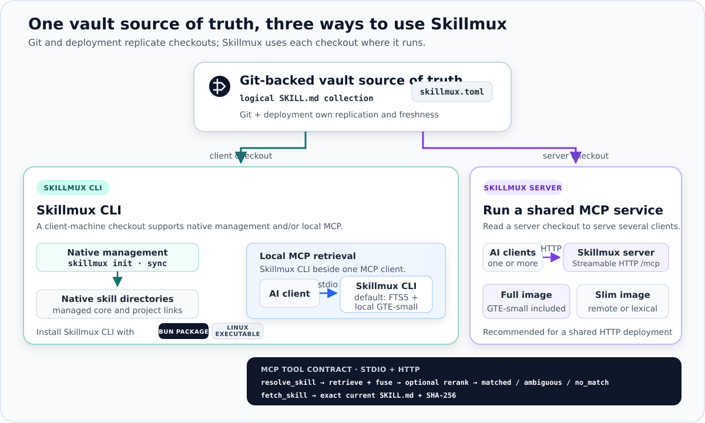

<p align="center">
  <picture>
    <source media="(prefers-color-scheme: dark)" srcset="https://raw.githubusercontent.com/klhq/skillmux/main/docs/assets/logo-dark.png">
    
  </picture>
</p>

<p align="center">
  <a href="https://github.com/klhq/skillmux/actions/workflows/ci.yml"></a>
  <a href="https://github.com/klhq/skillmux/releases/latest"></a>
  <a href="https://www.npmjs.com/package/@klhapp/skillmux"></a>
  <a href="LICENSE"></a>
</p>

<p align="center"><strong>One skill vault. Every AI coding client. Nothing lost in translation.</strong></p>

Every AI coding client wants its own skill folder and its own format. Skillmux
manages [`SKILL.md`](https://agentskills.io) collections across all of them
from one place. Keep one **vault source of truth** (the logical skill
collection), pin a small set into native skill directories, and retrieve the
rest through MCP. A **vault checkout** is a physical copy of that collection.
On one machine, `~/skills` can be both the source of truth and its checkout.

For a shared topology, the Git-backed vault source of truth has a checkout on
each client machine, where the Skillmux CLI creates native pins, and a checkout
on the server, where Skillmux server exposes HTTP MCP. Skillmux does not pull,
push, replicate, or determine freshness between checkouts; Git and the
deployment process own replication and freshness. See
[native pins with shared retrieval](docs/deployment.md#native-pins-with-shared-retrieval).

The same Skillmux CLI manages native skills and can serve local stdio MCP.
Most individual users need only the CLI. Add Docker when you need a shared or
always-on HTTP service.

`skillmux serve` starts local stdio without a config file. `skillmux serve
--transport http` likewise starts on loopback with safe defaults; create a
config only when you need to customize the vault, inference, or server policy.
See [Configuration](docs/configuration.md#machine-config-bootstrap) and
[Deployment](docs/deployment.md) for those next steps.

Choose a setup by the job:

1. Need native skills or local MCP for one client? Install the **Skillmux CLI**.
2. On Linux when Bun is undesirable? Use the **standalone Linux executable**;
   it is the same Skillmux CLI.
3. Need one shared HTTP MCP service? Deploy the **full image**, the
   self-contained default with GTE-small.
4. Already have remote embeddings, or intentionally want lexical-only
   retrieval? Use the **slim image**; see [Deployment](docs/deployment.md).

For native pins and shared retrieval, run the Skillmux CLI on the machines that own
   client directories and one shared server for routed retrieval. MCP-only
clients connect over HTTP and do not need the Skillmux CLI.

Manage the server's vault checkout outside the container. Use the CLI for
Skillmux operations and Git or your deployment process for replication and
freshness; server images do not manage host agent directories.
If a server image rejects a management command, its error names the host CLI
command to run; see the [container command contract](docs/deployment.md#container-command-contract).

## One vault source of truth, three ways to use it

<p align="center">
  
</p>

“Local” describes where Skillmux runs. “Local inference” means the embedding
model runs in the Skillmux process. Both stdio and HTTP expose the same
`resolve_skill` and `fetch_skill` MCP tools.

## Install the CLI

The Bun package supports macOS, Linux, and Windows and requires
[Bun 1.3 or newer](https://bun.sh/docs/installation):

```sh
bun add -g @klhapp/skillmux
skillmux --help
```

Native target sync needs permission to create directory symlinks on Windows.

On Linux, you can install a standalone executable instead. This path needs no
GitHub CLI or package manager. It selects AMD64 or ARM64, downloads the pinned
`v1.3.4` release, and verifies the SHA-256 digest published for that release:

```sh
version=v1.3.4
case "$(uname -m)" in
  x86_64|amd64) asset=skillmux-linux-amd64; sha256=0d0155475748a937ac9b5878c57e1fa14d8fe6957317cb43bbdafd710cbc1966 ;;
  aarch64|arm64) asset=skillmux-linux-arm64; sha256=8cd186707221a8fefbb79eac46ef14d0c5fdae08a2d76e64a01af17a80af0e06 ;;
  *) echo "Unsupported architecture: $(uname -m)" >&2; exit 1 ;;
esac
bin_dir="${SKILLMUX_BIN_DIR:-$HOME/.local/bin}"
curl --fail --location --output "$asset" "https://github.com/klhq/skillmux/releases/download/$version/$asset"
printf '%s  %s\n' "$sha256" "$asset" | sha256sum --check -
install -Dm755 "$asset" "$bin_dir/skillmux"
```

Ensure `~/.local/bin` is on `PATH`. To install system-wide, explicitly choose
the target: `sudo install -Dm755 "$asset" /usr/local/bin/skillmux`. For GitHub
build-provenance verification, use the [attested GitHub CLI procedure](docs/getting-started.md#install-with-github-cli-attestation).
See [Deployment](docs/deployment.md) for the full and slim images of Skillmux
server.

## Quick starts

Skillmux uses `~/skills` as its default vault:

```text
~/skills/
└── csv-formatter/
    └── SKILL.md
```

### Manage native skills

Run the setup planner, then verify its managed links:

```sh
skillmux init
skillmux sync
skillmux doctor
```

The planner detects clients, asks which skills belong in the core tier, and
shows every write before confirmation. Use explicit flags for automation:

```sh
skillmux init \
  --client claude-code \
  --client codex \
  --core csv-formatter \
  --dry-run

skillmux init \
  --client claude-code \
  --client codex \
  --core csv-formatter \
  --yes
```

Core pins apply to each configured target and stay capped at 25 skills. Add
project-specific skills from a repository root:

```sh
skillmux project init
```

### Add local MCP retrieval

Prefetch the default GTE-small model, index the vault, and start stdio MCP:

```sh
skillmux models download
skillmux index
skillmux doctor
skillmux serve
```

The model cache lives at `~/.cache/skillmux/models`. If you skip the prefetch,
Skillmux downloads the model when local inference first needs it.

### Run a shared MCP service

The full image includes GTE-small and serves Streamable HTTP on `/mcp`:

```sh
docker run -d \
  --name skillmux \
  -v ~/skills:/vault:ro \
  -v skillmux-data:/data \
  -p 3000:3000 \
  ghcr.io/klhq/skillmux:latest
```

Use `ghcr.io/klhq/skillmux:latest-slim` when you want remote embeddings or
lexical fallback instead of a bundled model. Docker Hub mirrors both variants
under `docker.io/klhq/skillmux`.

The [getting-started guide](docs/getting-started.md) provides complete recipes
for all three setups.

### HTTP surfaces

| Surface | User | Purpose | CLI required |
| --- | --- | --- | --- |
| `/mcp` | AI clients | Resolve and fetch skills | No |
| `/admin/v1/*` | Operators | Inspect or update server configuration | Yes, when using named CLI contexts |

MCP clients authenticate only to `/mcp` with the MCP bearer token. Operators
use a separate administrative bearer token for `/admin/v1/*`; neither token
authorizes the other surface. Named CLI contexts administer the deployed server
only. They never install, pin, synchronize, or otherwise manage skill
directories on remote client machines. See [Deployment](docs/deployment.md#http-surfaces)
for configuration and examples.

## Add and inspect skills

Install a skill from a Git repository:

```sh
skillmux install owner/repo
skillmux install owner/repo/path/to/skill
```

Skillmux validates `SKILL.md` and scans candidate content before copying it into the vault. Use `--fail-on low|medium|high` to turn selected findings into an install gate.

Useful management commands:

```sh
skillmux scan ~/skills
skillmux core pin csv-formatter --yes
skillmux project pin my-project code-context --yes
skillmux skill which csv-formatter
skillmux report --since 7d
```

Read [Managing skills](docs/skill-management.md) for target ownership, project groups, local overrides, recovery, and reporting.

## MCP retrieval

Register it with an MCP client:

```json
{
  "mcpServers": {
    "skillmux": {
      "command": "skillmux",
      "args": ["serve"]
    }
  }
}
```

Skillmux exposes two tools:

| Tool | Input | Result |
| --- | --- | --- |
| `resolve_skill` | Natural-language task description | A ranked shortlist of candidates |
| `fetch_skill` | Exact `skill_id` | The current `SKILL.md` body, SHA-256 digest, and supporting-file paths |

Skillmux uses the best available capability:

1. SQLite FTS5 provides lexical retrieval and offline fallback.
2. Local or remote embeddings add semantic recall.
3. An optional reranker scores and reorders candidates.

Skillmux returns a ranked shortlist and lets the calling model choose. Endpoint failures degrade to a healthy lower retrieval mode instead of taking the MCP server down.

Read [MCP routing](docs/mcp-routing.md) for transports, client instructions, retrieval modes, and the wire contract.

## Supported clients

| Client | Native skill delivery | MCP setup |
| --- | --- | --- |
| Claude Code | `~/.claude/skills` | Configure in the client |
| Codex | `$CODEX_HOME/skills` or `~/.codex/skills` | Configure in the client |
| Gemini CLI, OpenCode, GitHub Copilot, Windsurf | `~/.agents/skills` | Configure in the client |
| Antigravity | `~/.gemini/config/skills` | Configure in the client |
| Goose, Hermes | Manual full-vault setup | Manual registration |
| Custom clients | Any directory through a custom target | Stdio or Streamable HTTP |

Skillmux preserves existing instruction files and unmanaged target content. Run `skillmux init --dry-run` to inspect every planned filesystem change.

## Guarantees

- **Controlled sources:** pins come from the configured vault checkout, while routed delivery follows the configured overlay order.
- **Scoped writes:** management commands write only to documented config, vault, state, and adopted target paths.
- **Managed ownership:** sync removes only entries recorded in the target's `.skillmux` marker.
- **Current bytes:** MCP delivery hashes the file on disk and never serves a stale indexed body.
- **Graceful retrieval:** embedding and reranker failures fall back without hiding the active capability.
- **Auditable decisions:** each `resolve_skill` call records its query, retrieval capability, candidates, scores, and latency in the state database.

## Documentation

Start with the [documentation hub](docs/README.md).

| Guide | Covers |
| --- | --- |
| [Getting started](docs/getting-started.md) | Native management, local MCP, and shared-service recipes |
| [Concepts](docs/concepts.md) | Delivery tiers, deployment topologies, retrieval modes, and ownership |
| [Managing skills](docs/skill-management.md) | Install, scan, pin, sync, report, overlays, and recovery |
| [MCP routing](docs/mcp-routing.md) | Tools, ranked candidate retrieval, transports, fallback, and integrity |
| [Deployment](docs/deployment.md) | Docker, container command boundaries, HTTP surfaces and auth, CORS, rate limits, and comparable CLI, health, and metrics status |
| [Configuration](docs/configuration.md) | Machine config, inference, HTTP surfaces, manifests, overlays, and container read-only configuration |
| [CLI reference](docs/cli.md) | Host and container command surfaces, administrative contexts, automation, JSON output, and exit codes |
| [Ranked-shortlist migration](docs/ranked-shortlist-migration.md) | Upgrade guide for the ranked-only contract |
| [Troubleshooting](docs/troubleshooting.md) | `doctor`, deployment identity, common failures, and migration notes |
| [MCP schema](docs/schema.json) | JSON Schema 2020-12 tool contract |

## Development

Skillmux uses Bun for development:

```sh
bun install --frozen-lockfile
bun test
bun run build
```

Read [CONTRIBUTING.md](CONTRIBUTING.md) for the development workflow and [SECURITY.md](SECURITY.md) for vulnerability reporting.

## License

[MIT](LICENSE)
