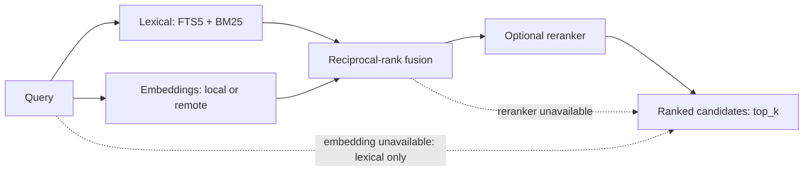

# MCP routing

Skillmux exposes its configured vault checkout through two Model Context
Protocol tools. A vault source of truth is the logical collection; a checkout
is its physical copy. Choose a transport based on where the process runs:

| Topology | Transport | Typical package |
| --- | --- | --- |
| Skillmux beside one client | stdio | Skillmux CLI |
| Shared Skillmux server | Streamable HTTP | Full image by default; slim image for remote or lexical retrieval |

Both transports expose the same `resolve_skill` and `fetch_skill` contract.
Local native pinning is optional and can run beside stdio MCP.

## Register a stdio server

Start the server:

```sh
skillmux index
skillmux doctor
skillmux serve
```

Register the command in your MCP client:

```json
{
  "mcpServers": {
    "skillmux": {
      "command": "skillmux",
      "args": ["serve"]
    }
  }
}
```

The default transport is stdio. The process exits when the client closes its
input stream or sends a termination signal.

## Connect to a shared HTTP service

Start a Streamable HTTP server:

```sh
skillmux serve --transport http --port 3000
```

Clients send MCP requests to:

```text
http://127.0.0.1:3000/mcp
```

The default host accepts loopback connections only. Configure authentication
and network exposure before serving other machines. See
[Deployment](deployment.md#expose-http-safely).

This is the MCP surface for AI clients. Its bearer token applies only to
`/mcp`; server configuration uses the separate operator surface at
`/admin/v1/*`. AI clients do not need the CLI to use `/mcp`; named CLI contexts
are for administering the deployed server, not remote agent skill directories.
See [Deployment](deployment.md#http-surfaces).

## Tool contract

### `resolve_skill`

Input:

```json
{
  "query": "convert this spreadsheet to a Markdown table",
  "top_k": 5
}
```

Skillmux returns a ranked candidates response:

```json
{
  "request_id": "3fae2b8e-6c2d-4b1a-9d7a-2b6c5b6a9e10",
  "retrieval": "reranked",
  "candidates": [
    {
      "rank": 1,
      "skill_id": "csv-formatter",
      "description": "Convert CSV and spreadsheets into formatted Markdown tables.",
      "score": 0.92
    }
  ]
}
```

- `request_id`: a unique id minted for this resolve. Pass it back to `fetch_skill` to correlate a fetch outcome with this resolve and the fetched skill's rank in this shortlist.
- `retrieval`: the effective retrieval capability (`reranked`, `hybrid`, or `lexical`).
- `candidates`: zero through effective `top_k` candidates ordered by descending score with contiguous 1-based ranks.
- If reranking or embedding fails, degradation metadata (`degraded_from`, `degradation_reason`) is included.

### `fetch_skill`

Input:

```json
{
  "skill_id": "csv-formatter",
  "request_id": "3fae2b8e-6c2d-4b1a-9d7a-2b6c5b6a9e10"
}
```

The response contains the current `SKILL.md` body as text content.
`structuredContent` contains the skill ID, title, content SHA-256, and
supporting-file paths. `request_id` is optional. When it names a resolve that
minted it, the recorded fetch outcome links to that resolve and its rank in
the shortlist. An absent, unknown, or malformed `request_id` still succeeds
and records an uncorrelated fetch — delivery never fails because telemetry
could not correlate. Fetch does not depend on an earlier resolve call.

The complete wire contract lives in [schema.json](schema.json).

## Recommended agent behavior

Give the calling client these rules:

1. Call `resolve_skill` when a task may benefit from a specialized workflow.
2. Review the returned ranked candidates shortlist.
3. If a relevant candidate exists, call `fetch_skill` with its `skill_id` to retrieve complete instructions, passing back the resolve's `request_id` when the client retains it.
4. If no candidate is relevant (or `candidates` is empty), continue under your normal workflow.

Passing `request_id` is optional and never required for delivery, but it is
what lets Skillmux measure whether a returned shortlist was actually used.

## Retrieval pipeline



Skillmux builds candidates in stages:

1. SQLite FTS5 ranks lexical matches with BM25.
2. Local or remote embeddings rank semantic similarity.
3. Reciprocal-rank fusion combines both lists.
4. An optional reranker scores the fused candidates.
5. Returns up to effective `top_k` ranked candidates.

The default local inference configuration uses FTS5 and quantized
`Xenova/gte-small` embeddings. Skillmux CLI installations cache the
downloaded model under `~/.cache/skillmux/models`; the full image
includes it. The slim image starts with lexical retrieval and can call an
OpenAI-compatible embedding endpoint.

Remote inference also supports `jina-v1` or `bifrost-v1` reranker adapters.

Read [Configuration](configuration.md#local-inference) for local and remote
inference settings.

## Fallback and readiness

Skillmux advertises the capability it can support:

- embedding failure falls back to lexical retrieval;
- reranker failure preserves the hybrid shortlist;
- vault or index failure marks the server unready.

Check the active mode:

```sh
skillmux doctor
curl http://127.0.0.1:3000/health/ready
```

A ready server reports `lexical`, `hybrid`, or `reranked` along with skill and
index status.

## Content integrity

The index stores metadata and retrieval state. Delivery reads the file from
disk, computes its SHA-256, and returns those current bytes. If indexed
metadata has gone stale, Skillmux refreshes it before delivery.

Supporting files remain in the vault. `fetch_skill` lists their relative paths
so the calling workflow can locate them through its configured filesystem
access.

## Audit data

Each resolve request records:

- timestamp, `request_id`, and query;
- retrieval capability;
- degradation metadata (`degraded_from`, `degradation_reason`) when degraded;
- candidates with scores;
- latency in milliseconds.

Each fetch request records:

- timestamp and `skill_id`;
- the `request_id` supplied by the caller, or null when absent, unknown, or malformed;
- the originating resolve's audit row id, or null when the fetch is uncorrelated;
- `rank_at_resolve`: the fetched skill's rank in that resolve's shortlist, or null when the fetch is uncorrelated or the skill was absent from that shortlist.

Skillmux stores audit rows in `audit.sqlite3` under `state_dir`, a file
separate from the retrieval index. Use `skillmux report` to summarize
activity, `skillmux audit prune` to reclaim space under
`audit.retention_days` (default 90 days), and `skillmux eval promote` to turn
correlated fetches into eval cases — see [CLI
reference](cli.md#observability-and-evaluation-skillmux-report-audit-eval)
for all three. Treat raw queries as private user data when backing up or
sharing the database.
